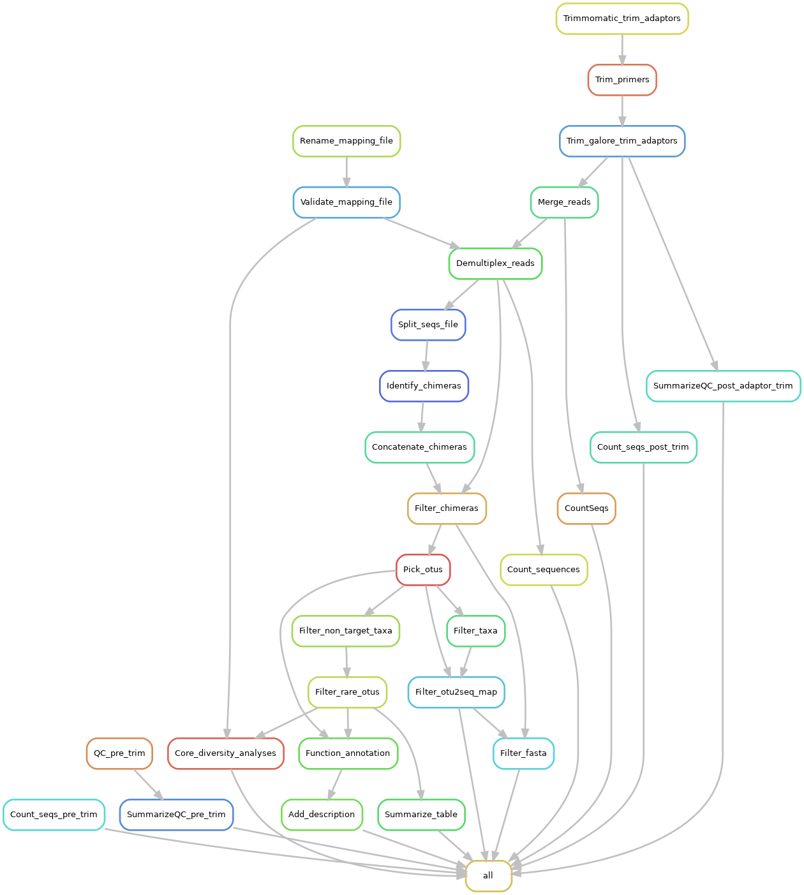

# qiime1-scripts and qiime1 workflow using snakemake

**MOTIVATION:** Qiime 1.9 has reached the end of its life ycle and thus no longer maintained by its developers. Moreover, QIIME 1.9 is infamously known to be very difficult to install due its many dependencies. Notwithstanding, I still find OTU picking a lot easier using qiime 1.9 than qiime 2. Moreover, I had developed a set of scripts for pathogen analysis using amplicon sequences by leveraging some outputs generated by QIIME 1.9. Which meant that my pathogen analysis scripts no longer work. To solve these problems, I decided to develop a QIMME 1.9 workflow that uses containers to alleviate the burden of software installation and snakemake for workflow orchestration and reproducibility.

**It is currently a work under progress, though.** The workflow performs microbiome analysis, pathogen analysis and functional annotation using QIIME 1.9 and PICRUSt2.

